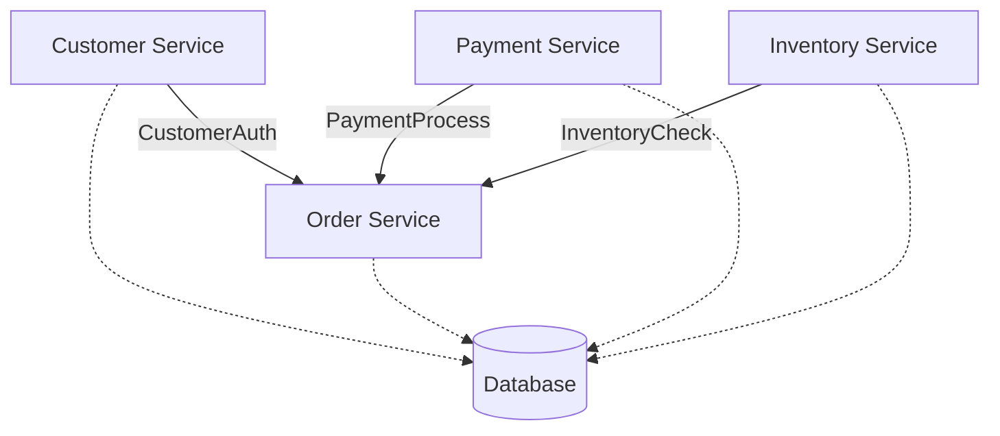
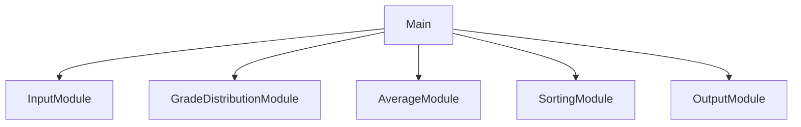
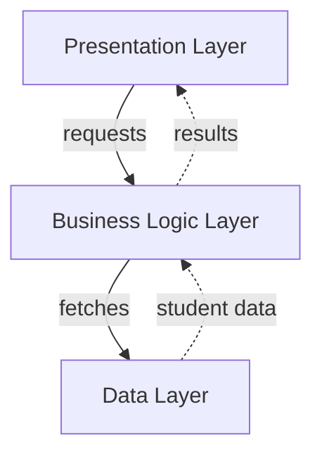

## Homework \#2

Ian Handy

---

## Question 1

**Similarity:** Both Layered and Modular architectures organize a system into distinct units that communicate through defined interfaces, promoting separation of concerns.

**Difference:** Layered architecture enforces strict hierarchical ordering — each layer may only communicate with the layer directly adjacent to it. Modular architecture imposes no such ordering; modules can interact with any other module through their defined interface.

---

## Question 2

**Similarity:** Both Modular and Layered architectures support extensibility by allowing new functionality to be added through discrete, self-contained units without modifying the rest of the system.

**Difference:** In Modular architecture, modules communicate directly with one another. In Layered architecture, all communication between plug-ins is mediated by the central core — plug-ins do not interact directly with each other.

---

## Question 3

For a large e-commerce application experiencing scalability and maintainability difficulties due to a monolithic architecture, I would recommend adopting the Microservice Architecture.

Microservice architecture allows the greatest flexibility and scalability with the ability to concentrate more effectively on the areas of the business that require the most care.

---

## Question 4

### UML Component Diagram — Small E-Commerce Application



> Solid arrows = provided interfaces. Dashed arrows = required dependency on Database.

| Interface      | Provider          | Consumer      | Purpose                                                 |
| -------------- | ----------------- | ------------- | ------------------------------------------------------- |
| CustomerAuth   | Customer Service  | Order Service | Verifies customer identity before an order is placed    |
| PaymentProcess | Payment Service   | Order Service | Charges the customer when an order is confirmed         |
| InventoryCheck | Inventory Service | Order Service | Confirms stock availability and updates levels on order |
| IDatabase      | Database          | All Services  | Persistent read/write storage for each domain           |

---

## Question 5

The `Student` data class is shared across both designs.

```java
public class Student {
    private String id;
    private String name;
    private int grade;

    public Student(String id, String name, int grade) {
        this.id = id;
        this.name = name;
        this.grade = grade;
    }

    public String getId() { return id; }
    public String getName() { return name; }
    public int getGrade() { return grade; }
}
```

---

### Design 1: Modular Architecture

Five single-responsibility modules are coordinated by `Main`, which passes a shared student list between them.



| Module                  | Responsibility                       | Information Hidden           |
| ----------------------- | ------------------------------------ | ---------------------------- |
| InputModule             | Reads student IDs, names, and grades | Scanner logic, input parsing |
| GradeDistributionModule | Counts students per letter grade     | Grade boundary logic         |
| AverageModule           | Computes class average               | Running total accumulation   |
| SortingModule           | Sorts students by grade descending   | Sort algorithm               |
| OutputModule            | Prints all results                   | Formatting and display logic |

```java
import java.util.ArrayList;
import java.util.List;
import java.util.Scanner;

public class InputModule {

    public static List<Student> readStudents() {
        List<Student> students = new ArrayList<>();
        Scanner scanner = new Scanner(System.in);

        System.out.println("Enter number of students:");
        int count = Integer.parseInt(scanner.nextLine().trim());

        for(int i = 0; i < count; i++) {
            System.out.println("\nStudent " + (i + 1) + " ID:");
            String id = scanner.nextLine().trim();
            System.out.println("Name:");
            String name = scanner.nextLine().trim();
            System.out.println("Grade (0-100):");
            int grade = Integer.parseInt(scanner.nextLine().trim());
            students.add(new Student(id, name, grade));
        }

        scanner.close();
        return students;
    }
}
```

```java
import java.util.List;

public class GradeDistributionModule {
    private int aCount, bCount, cCount, dCount, fCount;

    public void calculateDistribution(List<Student> students) {
        aCount = bCount = cCount = dCount = fCount = 0;

        for(int i = 0; i < students.size(); i++) {
            int grade = students.get(i).getGrade();
            if(grade >= 90) aCount++;
            else if(grade >= 80) bCount++;
            else if(grade >= 70) cCount++;
            else if(grade >= 60) dCount++;
            else fCount++;
        }
    }

    public int getACount() { return aCount; }
    public int getBCount() { return bCount; }
    public int getCCount() { return cCount; }
    public int getDCount() { return dCount; }
    public int getFCount() { return fCount; }
}
```

```java
import java.util.List;

public class AverageModule {
    private double average;

    public void computeAverage(List<Student> students) {
        if(students.isEmpty()) {
            average = 0;
            return;
        }

        int total = 0;
        for(int i = 0; i < students.size(); i++) {
            total += students.get(i).getGrade();
        }
        average = (double) total / students.size();
    }

    public double getAverage() { return average; }
}
```

```java
import java.util.ArrayList;
import java.util.Collections;
import java.util.List;

public class SortingModule {
    private List<Student> sortedStudents;

    public void sort(List<Student> students) {
        sortedStudents = new ArrayList<>(students);
        Collections.sort(sortedStudents, (a, b) -> b.getGrade() - a.getGrade());
    }

    public List<Student> getSortedStudents() { return sortedStudents; }
}
```

```java
import java.util.List;

public class OutputModule {

    public static void printDistribution(GradeDistributionModule dist) {
        System.out.println("\nGrade Distribution:");
        System.out.println("  A (90-100): " + dist.getACount());
        System.out.println("  B (80-89):  " + dist.getBCount());
        System.out.println("  C (70-79):  " + dist.getCCount());
        System.out.println("  D (60-69):  " + dist.getDCount());
        System.out.println("  F (0-59):   " + dist.getFCount());
    }

    public static void printAverage(AverageModule avg) {
        System.out.printf("\nClass Average: %.2f%n", avg.getAverage());
    }

    public static void printSortedGrades(List<Student> sortedStudents) {
        System.out.println("\nSorted Grades:");
        for(int i = 0; i < sortedStudents.size(); i++) {
            Student s = sortedStudents.get(i);
            System.out.println("  ID: " + s.getId() + "  |  Grade: " + s.getGrade());
        }
    }
}
```

```java
import java.util.List;

public class Main {

    public static void main(String[] args) {
        System.out.println("Grader - Mid-Term Grade Manager\n");

        List<Student> students = InputModule.readStudents();

        if(students.isEmpty()) {
            System.out.println("No students entered. Exiting.");
            return;
        }

        GradeDistributionModule distribution = new GradeDistributionModule();
        distribution.calculateDistribution(students);

        AverageModule average = new AverageModule();
        average.computeAverage(students);

        SortingModule sorter = new SortingModule();
        sorter.sort(students);

        OutputModule.printDistribution(distribution);
        OutputModule.printAverage(average);
        OutputModule.printSortedGrades(sorter.getSortedStudents());
    }
}
```

#### Evaluation

| Attribute | Score | Justification |
|---|---|---|
| **Modifiability** | 4 / 5 | Adding a student's major only requires updating `InputModule` and `OutputModule` — the distribution, average, and sorting modules are untouched. |
| **Reusability** | 5 / 5 | Each module is self-contained with no cross-dependencies. `GradeDistributionModule`, `AverageModule`, and `SortingModule` can be dropped into any grading application without modification. |

---

### Design 2: Layered Architecture

Three horizontal layers communicate strictly top-down: Presentation → Business Logic → Data. Results bubble back up.



```java
import java.util.ArrayList;
import java.util.List;
import java.util.Scanner;

public class StudentRepository {
    private List<Student> students = new ArrayList<>();

    public void loadStudents() {
        Scanner scanner = new Scanner(System.in);

        System.out.println("Enter number of students:");
        int count = Integer.parseInt(scanner.nextLine().trim());

        for(int i = 0; i < count; i++) {
            System.out.println("\nStudent " + (i + 1) + " ID:");
            String id = scanner.nextLine().trim();
            System.out.println("Name:");
            String name = scanner.nextLine().trim();
            System.out.println("Grade (0-100):");
            int grade = Integer.parseInt(scanner.nextLine().trim());
            students.add(new Student(id, name, grade));
        }

        scanner.close();
    }

    public List<Student> getAllStudents() { return students; }
}
```

```java
import java.util.ArrayList;
import java.util.Collections;
import java.util.List;

public class GradeProcessor {
    private StudentRepository repository;

    public GradeProcessor(StudentRepository repository) {
        this.repository = repository;
    }

    public int[] getGradeDistribution() {
        int[] counts = new int[5];
        List<Student> students = repository.getAllStudents();

        for(int i = 0; i < students.size(); i++) {
            int grade = students.get(i).getGrade();
            if(grade >= 90) counts[0]++;
            else if(grade >= 80) counts[1]++;
            else if(grade >= 70) counts[2]++;
            else if(grade >= 60) counts[3]++;
            else counts[4]++;
        }
        return counts;
    }

    public double getAverage() {
        List<Student> students = repository.getAllStudents();
        if(students.isEmpty()) return 0;

        int total = 0;
        for(int i = 0; i < students.size(); i++) {
            total += students.get(i).getGrade();
        }
        return (double) total / students.size();
    }

    public List<Student> getSortedStudents() {
        List<Student> sorted = new ArrayList<>(repository.getAllStudents());
        Collections.sort(sorted, (a, b) -> b.getGrade() - a.getGrade());
        return sorted;
    }
}
```

```java
import java.util.List;

public class GradeUI {
    private StudentRepository repository;
    private GradeProcessor processor;

    public GradeUI() {
        repository = new StudentRepository();
        processor = new GradeProcessor(repository);
    }

    public void run() {
        System.out.println("Grader - Mid-Term Grade Manager\n");

        repository.loadStudents();

        int[] dist = processor.getGradeDistribution();
        System.out.println("\nGrade Distribution:");
        System.out.println("  A (90-100): " + dist[0]);
        System.out.println("  B (80-89):  " + dist[1]);
        System.out.println("  C (70-79):  " + dist[2]);
        System.out.println("  D (60-69):  " + dist[3]);
        System.out.println("  F (0-59):   " + dist[4]);

        System.out.printf("\nClass Average: %.2f%n", processor.getAverage());
        
        List<Student> sorted = processor.getSortedStudents();
        System.out.println("\nSorted Grades:");
        for(int i = 0; i < sorted.size(); i++) {
            Student s = sorted.get(i);
            System.out.println("  ID: " + s.getId() + "  |  Grade: " + s.getGrade());
        }
    }

    public static void main(String[] args) {
        new GradeUI().run();
    }
}
```

#### Evaluation

| Attribute | Score | Justification |
|---|---|---|
| **Modifiability** | 3 / 5 | Adding a student's major requires changes at every layer — `StudentRepository` must store it, `GradeProcessor` must pass it through, and `GradeUI` must display it, even though the major has no effect on grade computation. |
| **Reusability** | 3 / 5 | `GradeProcessor` could be reused with a different front-end, but each layer is tightly coupled to the data contract of the layer below, making isolated reuse in an unrelated system impractical. |
