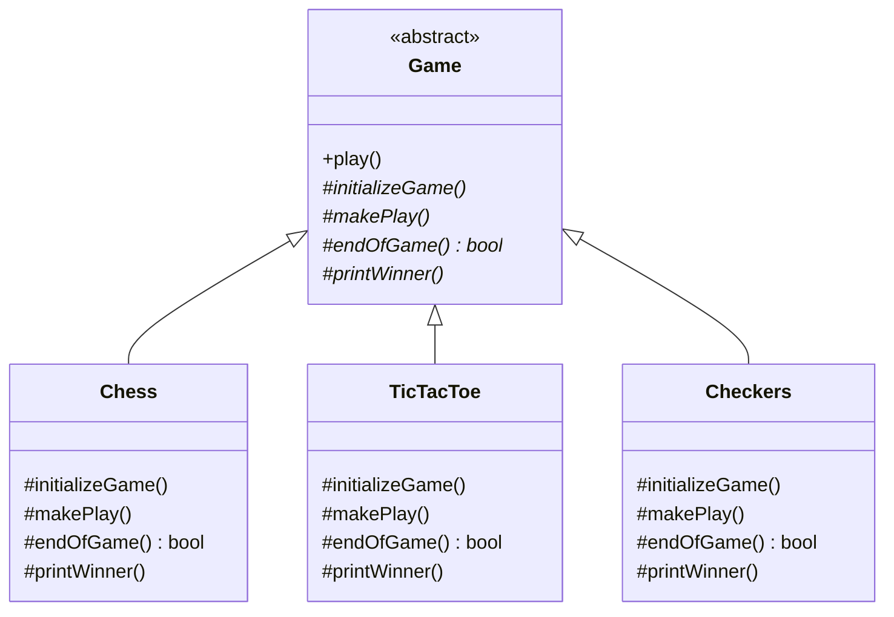
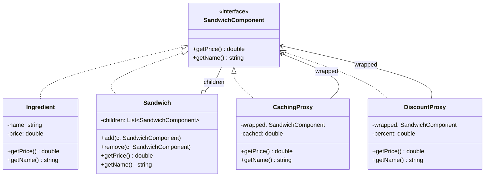

## Homework #3

Ian Handy

---

## Question 1 — Template Method (GameX)

Template method was created to support games as well as other applications that have the same general process, however each game has different processes used within the general process. In this example, the template method will work perfectly because there is a generic algorithm structure in the abstract base class where each part of the algorithm can be replaced with a unique implementation in each of the concrete subclasses.

### Design

`Game` is the base abstract class. It contains the template method `play()` that is called when a new game is started. This method calls the four methods in the correct order and is declared `final` so no subclass can change the order. However, since each of these four steps are defined as primitives, they need to be implemented differently for each type of game that inherits from `Game`.

### UML Diagram



### Pseudocode

```
Game.play():
    initializeGame()
    while not endOfGame():
        makePlay()
    printWinner()
```

In the above pseudocode, `play()` is the common algorithm structure that will always be executed in the same order. `initializeGame`, `makePlay`, `endOfGame`, and `printWinner` represent the unique parts of the algorithm that will be implemented based upon the type of game being played. For instance, in `Chess`, `initializeGame` would create an 8x8 square chessboard with standard Chess pieces placed upon it. In `TicTacToe`, `initializeGame` would create a 3x3 tic-tac-toe grid. The client does not know what type of game is being played, but can still execute the `play()` method to begin playing the current game.

---

## Question 2 — Composite + Proxy (Sandwich Pricing)


This question is about creating a sandwich application. A sandwich consists of a base and optional toppings. Toppings can contain additional items (i.e. a Deluxe Veggie Mix includes lettuce, tomato, onion). We want to calculate the cost of both individual items (toppings) and groups of items (the full sandwich) using a single interface. This represents the Composite Design pattern. Additionally, we want to include features such as price caching, discounting and nutritional information, which do not modify existing item interfaces. These requirements represent the Proxy Design pattern.

### Assumptions

- All items that can be priced (either a single item or a collection of items) implement the `SandwichComponent` interface.
- A sandwich object is a composite object consisting of a bread and its toppings.
- Prices are constant during a session, but may vary from session to session, making price caching valuable.
- Discounts will be applied to entire subtrees (i.e. 20% off the entire sandwich), therefore applying a proxy to the root object suffices.
- Nutritional information will accumulate over children in much the same manner prices do — therefore it could use the same composition.

### UML Diagram




### How Do They Work Together?

- **Composite**: `Sandwich.getPrice()` calls `getPrice()` on each child, and sums those values. Children are also `SandwichComponent`s, so a compound topping (i.e. Deluxe Veggie Mix) can itself be a `Sandwich`-like composite containing its own children. The client treats leaves and composites identically.

- **Proxy — Caching**: `CachingProxy` wraps any `SandwichComponent`. When you call `getPrice()`, if that's the first time you've asked for it, it delegates to the wrapped component and caches the result; otherwise, it simply returns the cached value. Good for something expensive like a dozen or so ingredients getting repriced on every UI update.

- **Proxy — Discount**: `DiscountProxy` wraps any `SandwichComponent` and returns `wrapped.getPrice() * (1 - percent)`. Applied at the root, it discounts the entire sandwich; applied to some child, it discounts just that subtree (i.e. "half off all veggies").

- **Stacking Proxies**: since proxies are themselves `SandwichComponent`s, you can compose them freely: `new DiscountProxy(new CachingProxy(sandwich), 0.1)` discounts the cached price of the whole sandwich by 10%.

### Example Composition

```
DiscountProxy(10%)
  └── CachingProxy
        └── Sandwich
              ├── Ingredient(Sourdough, $1.50)
              ├── Ingredient(Turkey, $3.00)
              ├── Ingredient(Swiss, $1.00)
              └── Sandwich(DeluxeVeggieMix)
                    ├── Ingredient(Lettuce, $0.25)
                    ├── Ingredient(Tomato, $0.50)
                    └── Ingredient(Onion, $0.25)
```

Client asks for `getPrice()` on the outer `DiscountProxy`, and gets the final discounted total — $5.85 — without even realizing whether caching, discounting, or nested composition happened inside.