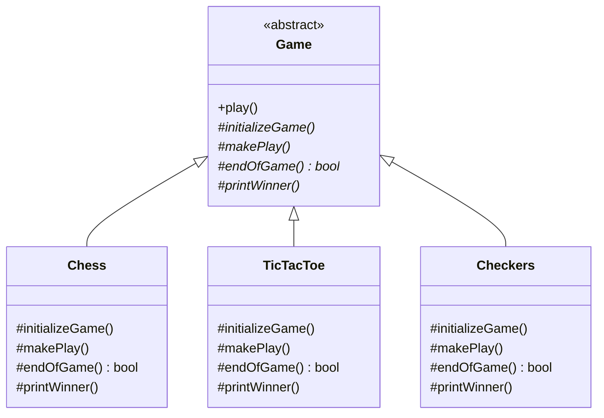
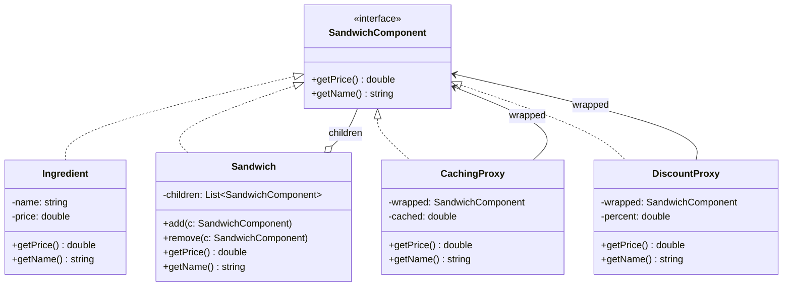

## Homework \#3

Ian Handy

---

## Question 1 — Template Method (GameX)

**Intent.** All games in GameX share the same high-level control flow (`initialize → makePlay → endOfGame → printWinner`) but differ in how each step is carried out. The Template Method pattern fits exactly: a fixed algorithm skeleton in an abstract base class, with each step deferred to concrete subclasses.

### Design

`Game` is the abstract base class. Its `play()` method is the *template method* — it calls the four steps in the required order and is marked `final` so subclasses cannot alter the sequence. Each step is an abstract primitive. Concrete subclasses (`Chess`, `TicTacToe`, `Checkers`) provide game-specific implementations.

### UML Diagram



### Template Method (pseudocode)

```
Game.play():
    initializeGame()
    while not endOfGame():
        makePlay()
    printWinner()
```

`play()` is the invariant algorithm — shared by every game. `initializeGame`, `makePlay`, `endOfGame`, and `printWinner` are the variable parts, implemented per subclass (e.g., Chess sets up an 8×8 board with standard pieces; TicTacToe sets up a 3×3 grid).

---

## Question 2 — Composite + Proxy (Sandwich Pricing)

**Intent.** A sandwich is built from a bread base and any number of toppings. Some toppings are themselves composed of sub-ingredients (e.g., a "Deluxe Veggie Mix" contains lettuce, tomato, onion). The client should be able to price any ingredient — leaf or group — through a single interface. That is the **Composite** pattern. On top of that, we want transparent add-ons (caching, discounts, nutrition tracking) without changing the ingredient classes themselves — that is the **Proxy** pattern.

### Assumptions

- Every priceable thing — a single topping, a compound topping, or the whole sandwich — implements one interface: `SandwichComponent`.
- The sandwich itself is a composite whose children are the bread plus its toppings.
- Prices are stable during a session but may change day-to-day, which makes caching meaningful.
- Discounts apply to a whole subtree (e.g., 20% off the entire sandwich), so wrapping the root component is sufficient.
- Nutrition tracking is additive across children in the same way price is — it could reuse the same composition.
- Proxies conform to `SandwichComponent` so they can be nested (a `DiscountProxy` wrapping a `CachingProxy` wrapping a real `Sandwich`).

### UML Diagram



### How the pieces fit together

- **Composite.** `Sandwich.getPrice()` iterates its children and sums their `getPrice()` calls. Since each child is also a `SandwichComponent`, a compound topping (e.g., Deluxe Veggie Mix) can itself be a `Sandwich`-like composite with its own children. The client treats leaves and composites identically.
- **Proxy — Caching.** `CachingProxy` wraps any `SandwichComponent`. On first `getPrice()` call it delegates to the wrapped component and stores the result; subsequent calls return the cached value. Useful for an expensive composite like a sandwich with dozens of ingredients being re-priced on every UI refresh.
- **Proxy — Discount.** `DiscountProxy` wraps any `SandwichComponent` and returns `wrapped.getPrice() * (1 - percent)`. Applied at the root, it discounts the entire sandwich; applied to a specific child, it discounts just that subtree (e.g., "half off all veggies").
- **Stacking proxies.** Because proxies are themselves `SandwichComponent`, they compose freely: `new DiscountProxy(new CachingProxy(sandwich), 0.1)` discounts the cached price of the whole sandwich by 10%.

### Example composition

```
DiscountProxy(10%)
  └── CachingProxy
        └── Sandwich
              ├── Ingredient(Sourdough, $1.50)
              ├── Ingredient(Turkey, $3.00)
              ├── Ingredient(Swiss, $1.00)
              └── Sandwich(DeluxeVeggieMix)
                    ├── Ingredient(Lettuce, $0.25)
                    ├── Ingredient(Tomato, $0.50)
                    └── Ingredient(Onion, $0.25)
```

The client calls `getPrice()` on the outer `DiscountProxy` and receives the final discounted total — `$5.85` — without knowing or caring whether caching, discounting, or nested composition occurred internally.
